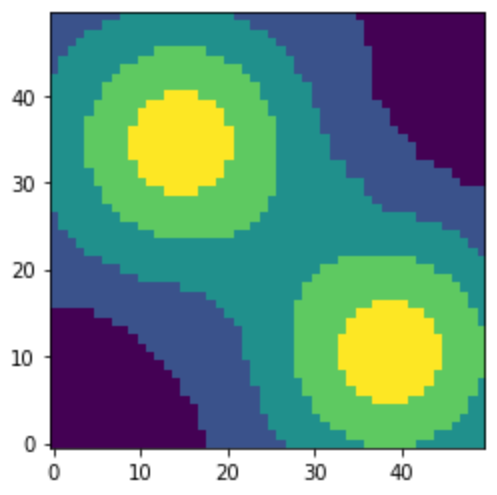

# Constant Growback Model with Traders

## Summary

This is Epstein & Axtell's Sugarscape model with Traders, a detailed description is in Chapter four of Growing Artificial Societies: Social Science from the Bottom Up. (1996).

Here an agent-based computer modeling techniques are applied to the study of human social phenomena, including trade, migration, group formation combat, interaction with an environment, transmission of culture propagation of disease, and population dynamics.

## Environment

Resources distribution over the landscape

## Rules

### Agents:

- Sugar: Sugar agents grow back at one unit per time step and can be harvested and traded by the trader agents. Sugar is unequally distributed across the landscape with sugar hills in the upper left and lower right of the space. (green if you do the interactive run)
- Spice: Spice agents grow back at one unit per time step and can be harvested and traded by the trader agents. Spice is unequally distributed across the landscape with spice hills in the upper right and lower left of the space. (yellow if you do the interactive run)
- Traders: Trader agents have the following attributes: (1) metabolism for sugar, (2) metabolism for spice, (3) vision, (4) initial sugar endowment and (5) initial spice endowment. The traverse the landscape harvesting sugar and spice and trading with other agents. If they run out of sugar or spice then they are removed from the model.

The trader agents traverse the landscape according to rule M:

- Look out as far as vision permits in the four principal lattice directions and identify the unoccupied site(s).
- Considering only unoccupied sites find the nearest position that produces the most welfare using the Cobb-Douglas function.
- Move to the new position
- Collect all the resources (sugar and spice) at that location (Epstein and Axtell, 1996, p. 99)

The traders trade according to rule T:

- Agents and potential trade partner compute their marginal rates of substitution (MRS), if they are equal end.
- Exchange resources, with spice flowing from the agent with the higher MRS to the agent with the lower MRS and sugar flowing the opposite direction.
- The price (p) is calculated by taking the geometric mean of the agents' MRS.
- If p > 1 then p units of spice are traded for 1 unit of sugar; if p < 1 then 1/p units of sugar for 1 unit of spice
- The trade occurs if it will (a) make both agent better off (increases MRS) and (b) does not cause the agents' MRS to cross over one another otherwise end.
- This process then repeats until an end condition is met. (Epstein and Axtell, 1996, p. 105)
